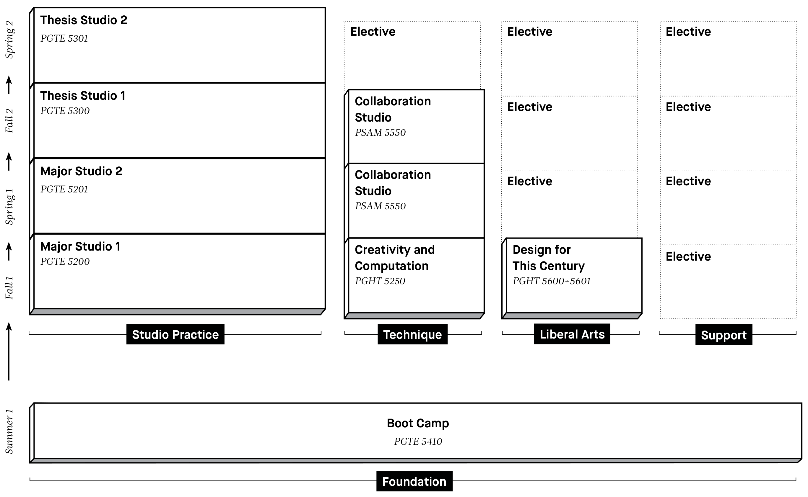

# Week 1 - Monday

# Studio Introduction
*3:50 - 4:30*

Individual presentations of the [Studio Introduction](../assignment_studio_introduction) assignment.

### Voting!
- clearest
- most memorable
- funniest
- friendliest
- most beautiful
- most entertaining
- least predictable
- most efficient
- best conceived
- best executed

# Design + Technology Introduction
*4:30 - 5:00*
### [Act I Carefully Arranged Sand and Lightning](https://docs.google.com/a/newschool.edu/presentation/d/1JhBhWI8IHTgY59WDwSWg-M0PJtsKe5YRz21G61lI1E4/present?usp=sharing)
### [Act II A Universal Level With Which to Move the World](https://docs.google.com/presentation/d/1JhBhWI8IHTgY59WDwSWg-M0PJtsKe5YRz21G61lI1E4/present?slide=id.g25052fa3b5_5_8)

# MS1 Intro + Syllabus Review
*5:00 - 5:30*

Review the class [syllabus](../syllabus.html).
- This is a class about making and discussing creative projects.
- You need to create and maintain a website for the work you create in this class.
- Follow the [MS1-D Slack](ms1-d.slack.com/) **at least** daily.
- The schedule is going to change.
- Attendance: Attend every class, arrive early, stay late.
- Plagiarism: Don't do it. Make everything yourself. Cite anything you don't.
- Workload: High.
- Questions?

# Studio Introduction Workshop
*5:30 - 6:00*

In class workshop on the methods and techniques that designers use to create their work.

[Studio Introduction Workshop](../workshop_studio_introduction)

# Meta Assignment: Get Ready for MS1

### Set up your Personal Website
*Due Tuesday 11:59pm*
- Set up a website where you can post text, photos, videos, and files. You will be using this site to post your work throughout the semester including: work-in-progress documentation, final projects, and written responses to the readings.
- Find a platform that works for you and that will let you easily and frequently post content.

### Reimagine your Studio Introduction
*Due Tuesday 11:59pm*
- Create a page on your website to represent your Studio Introduction assignment. Instead of documenting your presentation, you will reimagine it. This page should teach the same thing you taught in your presentation but should do so using *exactly* 100 words and 1 image.

### Get on Slack
*Due Tuesday 11:59pm*
- Create your slack account on our team: [https://ms1-d.slack.com](https://ms1-d.slack.com)
- Subscribe to the official, handouts, and chatter channels.
- Subscribe to the studio_introduction channel and make a single post with your name (as you would like to be called in class), a photo of yourself, and a link to the Studio Introduction page on your website.
